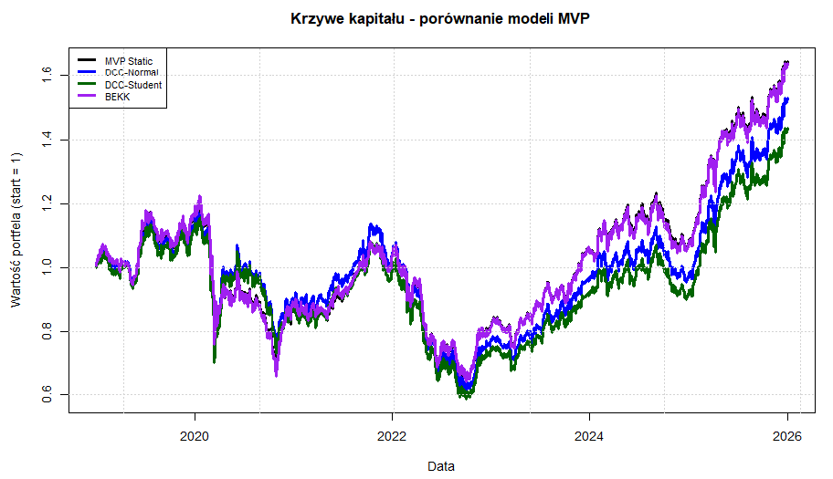
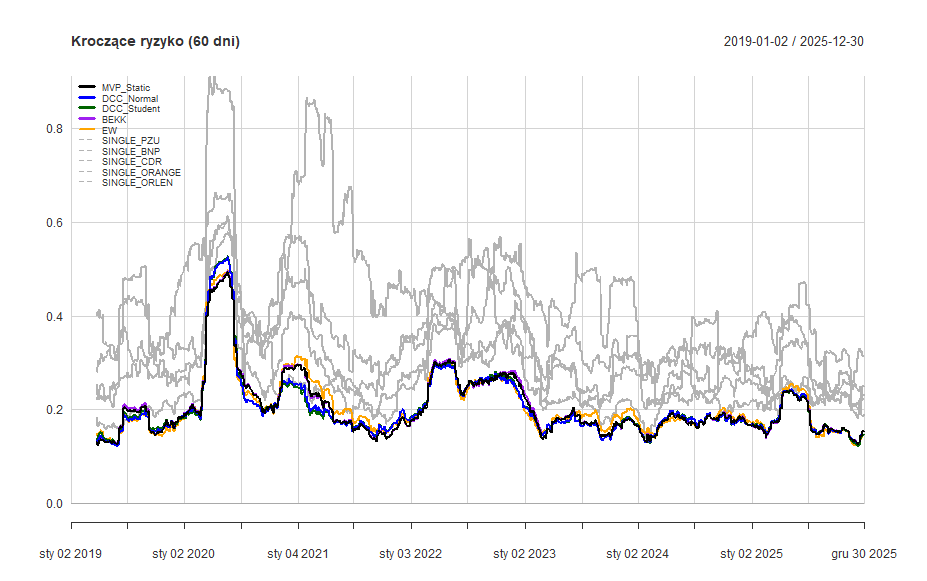

# Financial Econometrics: MVP vs. GARCH Portfolio Optimization

## 📊 Project Overview
This project presents a comprehensive analysis of the **Minimum Variance Portfolio (MVP)** for five major GPW instruments: **PZU, BNP, CDR, ORANGE, and ORLEN**. The study covers the period 2019-2025 and focuses on comparing the classical static Markowitz approach with dynamic models of multivariate volatility.

The models are verified based on efficiency measures (Sharpe Ratio), extreme risk (VaR, ES), and econometric tests such as Jarque-Bera and Diebold-Mariano.

## 📈 Strategy Performance
The following visualization compares the cumulative returns of the static MVP against dynamic GARCH-class models.

  

<em>Figure 1: Comparison of cumulative returns for different MVP models (2019-2025).</em>

## 🛠 Key Features & Methodology
* **Static MVP:** Optimization using a 500-day rolling window with weekly rebalancing.
* **Dynamic Volatility Models:** Implementation of advanced GARCH-class models:
    * **DCC-GARCH:** Estimated with Normal and Student-t distributions.
    * **BEKK-GARCH:** Capturing volatility spillovers between assets.
* **Econometric Testing:**
    * **Jarque-Bera:** Confirmed strong non-normality and "fat tails" in returns.
    * **Diebold-Mariano:** Comparing accuracy of variance predictions.
    * **VAR(1) Filtration:** Used to eliminate residual autocorrelation.

## ⚠️ Risk Dynamics
The models demonstrate high responsiveness to market shocks, especially during the 2020 pandemic.

  

<em>Figure 2: 60-day rolling annualized standard deviation. Models adapt effectively to volatility spikes.</em>

## 🏆 Results Highlights
* **Risk Reduction:** The MVP strategy successfully reduced total risk (Standard Deviation) by nearly **50%** compared to high-volatility assets like CDR.
* **Best Performer:** **DCC-GARCH (Normal)** achieved the best risk minimization with the lowest VaR at **1.94%**.
* **Efficiency:** While GARCH models provided the lowest risk metrics, the **Static MVP** maintained the highest Sharpe Ratio (0.4437) due to its economic efficiency.

## 📂 Project Structure
* `portfolio_optimization_garch.R`: Main R script with the full analytical pipeline.
* `/data`: CSV datasets for the analyzed GPW instruments.
* `/docs`: Full technical report (in Polish) with detailed statistical interpretations.
* `/img`: Visualizations used in this documentation.

## 🚀 How to Run
1. Clone the repository.
2. Install required R libraries: `quantmod`, `PerformanceAnalytics`, `rugarch`, `rmgarch`, `mgarchBEKK`.
3. Run the script `portfolio_optimization_garch.R`.
